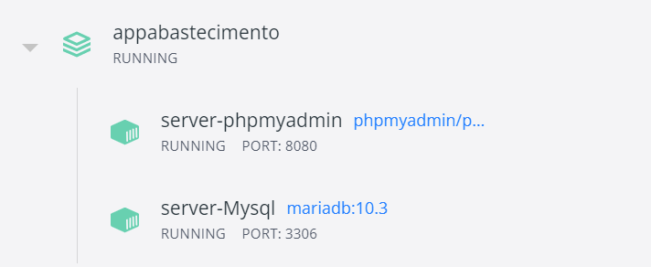

## APP de Gestão de abastecimento

Sistema de Gestão de Frotas de Veiculos. Este sistema possui um back-end e
front-end para gestão de frotas

### Dependências

* Node.js
	* Site oficial: https://nodejs.org/en/
* NPM
	* Site oficial: https://www.npmjs.com/
* Docker
	* Site oficial: https://www.docker.com/

### Utilização

Após clonar o projeto.

Inicialmente é necessário criar o docker container do banco de dados. Na pasta
raiz do projeto execute "docker-container up -d" para criar o container. Abaixo uma imagem da execução dos servidores MYSQL e PHPMYADMIN

E no back-end ou front-end e inicie aplicação com
"nodemon start". Maiores detalhes leia o README de cada projeto.

#### Back-end
* http://localhost:8000

#### Front-end
* http://localhost:3000

##### Versão node utilizado no desenvolvimento
	16.16.0

##### Versão npm utilizado no desenvolvimento
	8.11.0

##### Versão docker utilizado no desenvolvimento
		4.8.2
