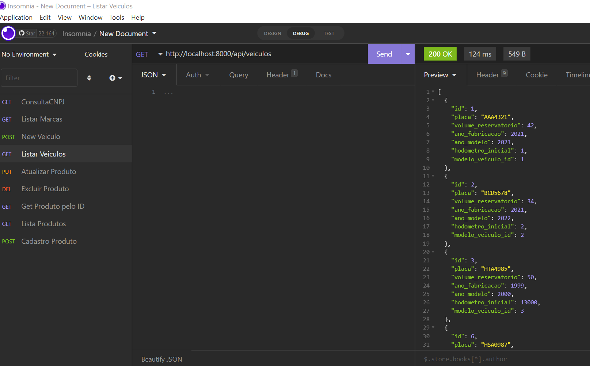

### Back-end APPAbastecimento usando Sequelize + Node.js + mySQL

Nesse projeto foi criado um simples CRUD, utilizando a biblioteca sequelize sobre Node.js
Express.js e MySQL.

### Dependências

* Node.js
	* Site oficial: https://nodejs.org/en/
* NPM
	* Site oficial: https://www.npmjs.com/

### Utilização

		Após acesso este diretorio de back-end utilize o comando **npm install --save** para instalar as dependências do projeto do back-end.

		Depois utilize o comando **nodemon start** para iniciar a aplicação.

    * http://localhost:8000

### Teste

Para teste sugerimos isnomnia

 
