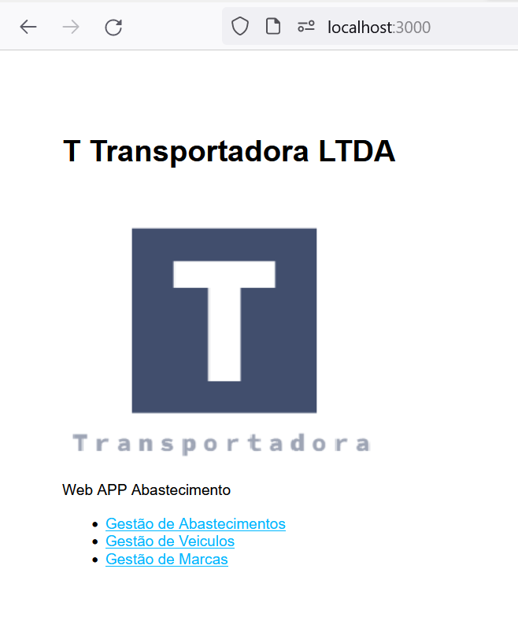

## Front-end APP1 Node.js Simple CRUD with Express.js and MySQL

Nesse projeto foi criado uma simples aplicação WEB, utilizando Node.js
Express.js e MySQL.

### Dependências

* Node.js
	* Site oficial: https://nodejs.org/en/
* NPM
	* Site oficial: https://www.npmjs.com/

### Utilização

	Após clonar o projeto, acesse o diretório onde se encontra o arquivo **package.json** e utilize o comando **npm install --save** para instalar as dependências do projeto.

	Depois utilize o comando **nodemon start** para iniciar a aplicação.

	  * http://localhost:3000

		### Teste

		Para teste sugerimos qualquer navegador WEB

